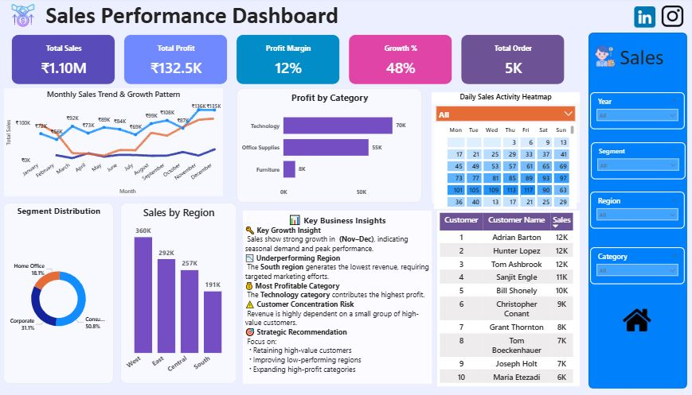

# 📊 Sales Performance Dashboard

## 📌 Project Overview
This dashboard transforms raw sales data into actionable business insights using data visualization, DAX calculations, and interactive reporting techniques. It enables users to monitor KPIs, identify high-performing regions and categories, and evaluate customer segment contributions effectively.

---

# 🎯 Objective
The main objective of this project is to:
- Analyze customer segments and regional contribution
- Track monthly and yearly growth trends
- Identify high-performing categories and customers
- Support data-driven business decision-making

---

# 📂 Dataset Information
The dataset contains sales records including:
- Order Details
- Customer Information
- Product Categories

### 📌 Key Columns
- Order Date
- Sales
- Profit
- Quantity
- Region
- Segment
- Category
- Customer Name

---

# 🛠 Tools & Technologies
- Power BI
- Power Query
- Advance DAX

---

# 🧹 Data Cleaning & Transformation
Data preprocessing and transformation were performed using Power Query Editor.

### ✅ Steps Performed
- Removed duplicate records
- Corrected data types
- Handled missing values
- Created Calendar table
- Standardized category and segment values
- Added Month and Year columns for time analysis

---

# 🏗 Data Modeling
A Star Schema data model was implemented for efficient analysis and reporting.

### 📌 Fact Table
- Orders

### 📌 Dimension Tables
- Customer Dataset
- Product Dataset
- Calendar Table

---

# 📊 Dashboard Features

## ✅ KPI Cards
- Total Sales
- Total Profit
- Profit Margin
- Growth %
- Total Orders

## ✅ Interactive Visuals
- Monthly Sales Trend
- Profit by Category
- Regional Sales Contribution
- Customer Segment Distribution
- Daily Sales Heatmap
- Top Customers Analysis

---

# 📈 DAX Measures Used
## Customer Rank
```DAX
Customer Rank =
RANKX(
    ALL(customer_dataset[Customer Name]),
    [Total Sales],
    ,
    DESC
)
```


# Top N Filtering

```DAX
Top N Sales =
IF(
    [Customer Rank] <= 10,
    [Total Sales],
    BLANK()
)
```


## ✅ Segment Distribution %

```DAX
Segment Distribution % =
DIVIDE(
    [Total Sales],
    CALCULATE(
        [Total Sales],
        ALL(customer_dataset[Segment])
    )
)
```


##  YoY Growth

```DAX
YoY Growth % =
DIVIDE(
    [Total Sales] - [Previous Year Sales],
    [Previous Year Sales]
)
```
---

# 🧠 Key Business Insights
- Technology category generated the highest profit contribution.
- West region contributed the highest overall sales.
- Consumer segment dominated total revenue generation.
- South region showed comparatively lower performance.

---

# 🚀 Strategic Recommendations
- Increase marketing efforts in low-performing regions.
- Focus on high-profit product categories such as Technology.
- Improve customer retention strategies for high-value customers.
- Expand Corporate customer engagement opportunities.

---

# ⚡ Performance Optimization
Several optimization techniques were implemented to improve dashboard performance and user experience:

- Optimized Star Schema data model
- Reusable DAX measures
- Time Intelligence using Calendar table
- Interactive slicers and filters

---

## 📁 Repository Structure

```text
sales-performance-dashboard/
│
├── README.md
├── Sales_Analysis_Final.pbix
├── sales_analysis_dashboard.JPG
├── Performance Optimization Summary.pdf
├── 📘 Portfolio Case Study.pdf
└── Sales_performance_dataset.zip
```

---
# 📸 Dashboard Preview



## 🔗 Live Dashboard
[View Power BI Dashboard](https://app.fabric.microsoft.com/links/hUtrfryg8W?ctid=1bf68a2d-798b-49ac-9cb7-f48ac13707d0&pbi_source=linkShare)

---

# 👨‍💻 Author
## Jay Sharma
